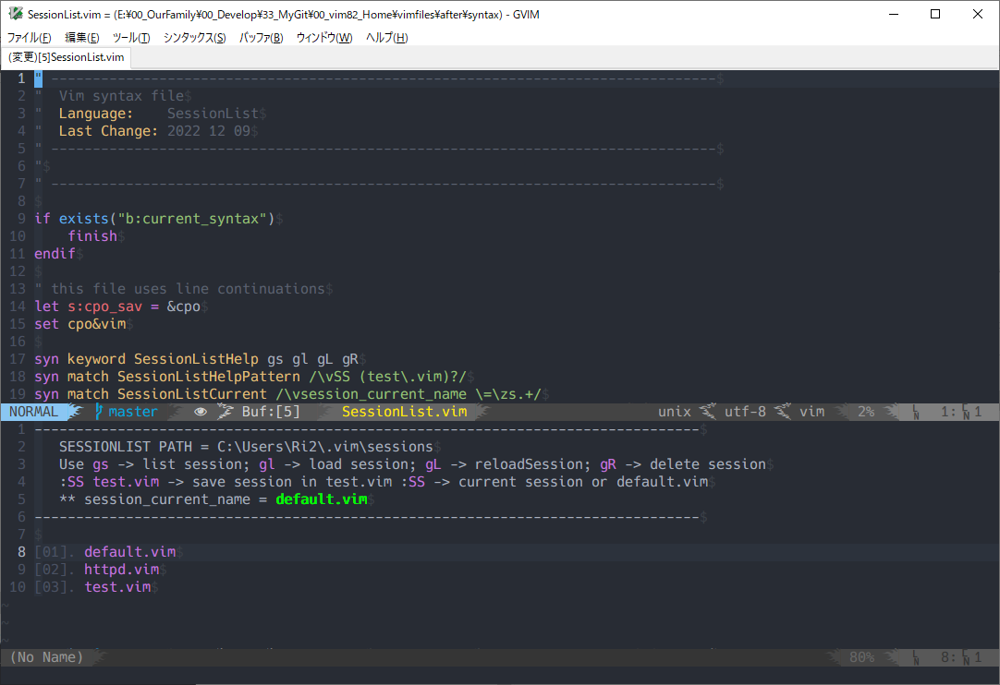

## What is this?
the simplest session manage plugin for vim

## Usage

in normal mode  

- gs : show or hide session list  
- gl : load session  
- gL : reload session when current session exist  
- gR : delete current session  

in command mode  

- :SS test.vim : save session with test.vim  
- :SS  save session with current session or default.vim  

